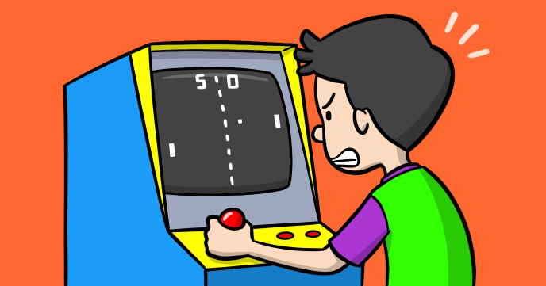

Pong is one of the earliest arcade games. As a successful game, it spawns countless of clones and derivatives on arcade machines, video consoles and personal computers.

By following this tutorial you’ll learn how to implement a clone of this popular game using JavaScript.

Feel free to further customize and skin the game and then share it with your family and friends.

 
## Source code 
The JavaScript source code of this program can be found [here](sketches/program.js). To run it, you need to import it in the [codeguppy.com](https://codeguppy.com) online editor. Alternatively, you can use the source code in your p5.js sketches (advanced use). 
## Online version 
To see the code running, check the online playground at [https://codeguppy.com/code.html?t=pong](https://codeguppy.com/code.html?t=pong) 
## Next steps 
Please check [codeguppy.com](https://codeguppy.com) for many other fun JavaScript programs and games for beginners. To stay up to date with CodeGuppy development please follow [@codeguppy](https://twitter.com/codeguppy) on Twitter.  
